# WebMail - Client Mail Professionnel Moderne


## Aperçu Général
WebMail est un client de messagerie web complet conçu pour offrir une expérience utilisateur comparable à celle des applications de bureau professionnelles (style Outlook). Il centralise la gestion multi-comptes IMAP/SMTP tout en intégrant des fonctionnalités avancées telles que le support S/MIME et OpenPGP, la synchronisation complète des calendriers et contacts, ainsi qu'une architecture extensible via un système de plugins. L'application est construite pour être robuste, fonctionnant en mode hors ligne (PWA) et adhérant aux meilleures pratiques de messagerie moderne.

**Fonctionnalités Clés :**
*   ✅ **Multi-Comptes :** Gestion simultanée de plusieurs boîtes mail IMAP/SMTP (compatibilité o2switch/cPanel).
*   🖼️ **Interface Pro :** Expérience utilisateur riche avec des catégories personnalisables, le chiffrement PGP/S/MIME et un éditeur HTML avancé.
*   ⚡ **Fonctionnalités Avancées :** Synchronisation Cloud (préférences), mode hors ligne (PWA) et support de l'IA intégrée via plugins Ollama.
*   🖥️ **Applications Natives :** PWA installable + applications Desktop (Windows, Linux, macOS) générées directement depuis le panneau d'administration via Docker ou GitHub Actions.

Pour une analyse détaillée, veuillez consulter les sections suivantes du fichier.

### Internationalisation (i18n)
WebMail est entièrement multilingue (français et anglais par défaut). L’interface détecte automatiquement la langue du navigateur et affiche la traduction appropriée. Vous pouvez contribuer à l’ajout d’autres langues ou à l’amélioration des traductions existantes.

**Contribuer à la traduction :**
- Les fichiers de traduction se trouvent dans `client/src/i18n/en.json` (anglais) et `client/src/i18n/fr.json` (français).
- Pour ajouter une langue, créez un fichier `xx.json` (où `xx` est le code langue ISO, ex : `es.json` pour l’espagnol) dans ce dossier, en reprenant la structure des fichiers existants.
- Les clés de traduction sont utilisées dans tout le code via la fonction `t('clé')` du hook `useTranslation()` (voir [react-i18next](https://react.i18next.com/)).
- Proposez vos ajouts ou corrections via une Pull Request (voir [CONTRIBUTING.md](CONTRIBUTING.md)).

**Sélection de la langue :**
La langue affichée est choisie selon l’ordre suivant :
1. Préférence enregistrée par l’utilisateur dans **Paramètres → Profil → Langue** (persistée en `localStorage`)
2. Français par défaut (modifiable dans `main.tsx`)

### Messagerie
- 📧 Multi-comptes IMAP/SMTP (compatible o2switch / cPanel)
- 📥 Boîte de réception, envoyés, brouillons, corbeille, spam, archives
- 📤 **Sauvegarde automatique dans "Envoyés"** : copie IMAP après envoi SMTP avec détection automatique du dossier
- 🤝 **Envoi "de la part de"** : stratégie d'en-têtes optimisée pour la délivrabilité (Sender/Reply-To selon domaine)
- ⭐ Drapeaux, marquage lu/non-lu, déplacement entre dossiers
- 🏷️ **Catégories de messages (style messagerie professionnelle)** : création / modification / gestion via le ruban (onglet Accueil), badges colorés et teinte de fond dans la liste, catégorisation = épinglage automatique, catégories favorites accessibles depuis la section **Favoris** comme filtre unifié multi‑boîtes
- 🗃️ **Archivage hiérarchique par date** : le bouton « Archiver » classe automatiquement le message dans `Archives/{année}/{mois}` (ex. `Archives/2026/04 - Avril`) en créant les dossiers manquants. Dossier racine et motif des sous-dossiers configurables par l'administrateur.
- 🖱️ Drag & drop des messages entre dossiers, **y compris entre comptes différents** (Ctrl/Cmd pour copier au lieu de déplacer)
- 🗂️ **Arborescence de dossiers hiérarchique** : sous-dossiers indentés, imbrication/désimbrication par glisser-déposer (déposer au centre d'un dossier = nest, sur l'en-tête du compte = un-nest)
- 📋 **Copie de dossier complet entre comptes** via glisser-déposer ou menu contextuel
- ↕️ **Réordonnancement des comptes et dossiers** par glisser-déposer, persistance locale
- ✏️ **Renommage local des boîtes mail** (clic droit sur un compte) sans impact serveur
- 👥 **Extension simultanée de plusieurs comptes** dans le volet de dossiers
- 🧹 Affichage du nom court des sous-dossiers (ex. `INBOX.test.sous` → « sous ») sans altérer le chemin IMAP réel
- 📎 Pièces jointes avec aperçu avancé (images, PDF, DOCX, XLSX, HEIC/HEIF)
- ℹ️ Aperçu DOCX/XLSX actuellement **simplifié** (contenu prioritaire, fidélité visuelle partielle)
- 🎛️ Comportement d'ouverture des pièces jointes configurable par utilisateur (Aperçu / Téléchargement / Menu / **Nextcloud** — enregistrement direct dans le drive NC au clic)
- ✏️ **Éditeur riche (HTML) style messagerie professionnelle** avec formatage avancé :
  - Police (Arial, Times, Courier, Georgia, Verdana, etc.) et taille (8px-72px)
  - **Gras**, *Italique*, <u>Souligné</u>, ~~Barré~~
  - Couleur du texte et surlignage (30 couleurs)
  - Alignement (gauche, centré, droite, justifié)
  - Listes à puces et numérotées avec indentation
  - Liens hypertextes et insertion d'images par URL
  - 😀 **Panneau Emojis latéral** (recherche, 8 catégories, récents) ouvert depuis l'onglet Insérer
  - 🎞️ **Panneau GIF latéral** propulsé par **GIPHY** (tendances, stickers, recherche) — voir [docs/CONFIGURATION.md](docs/CONFIGURATION.md#clé-api-giphy)
- 🔄 Synchronisation automatique
- ☕ **Répondeur d'absence (vacation auto-responder)** : configurable par boîte mail depuis **Paramètres → Répondeur** ou le bouton *Répondeur* de l'onglet **Afficher** du ruban (icône `Coffee` allumée quand actif). Sujet + corps HTML, plage de dates optionnelle, *une seule réponse par expéditeur sur N jours* configurable. **Transfert automatique optionnel** : pendant que le répondeur est actif, chaque nouveau mail reçu peut être renvoyé en copie (pièces jointes incluses) à un ou plusieurs destinataires saisis via un champ avec **autocomplétion contacts** (limite 20 adresses, garde-fous anti-boucle identiques à la réponse automatique). Détection IMAP en arrière-plan tolérante aux comptes partagés (`mailbox_assignments`), garde-fous anti-boucle (`Auto-Submitted`, `List-Unsubscribe`, `MAILER-DAEMON`, etc.), fréquence de vérification réglable par utilisateur (`1 / 5 / 15 / 30 / 60 min` ou jamais). Page d'administration **Admin → Répondeurs automatiques** avec liste filtrée, autocomplétion sur tous les comptes, édition / désactivation d'un répondeur existant, création pour le compte de n'importe quel utilisateur, et **toggle global + durée par défaut** (icône engrenage) qui masque la fonctionnalité côté utilisateurs si désactivée.
- 📝 Signature par compte
- ✍️ **Signatures multiples (style messagerie professionnelle)** : création / édition / suppression de plusieurs signatures HTML depuis l'onglet **Insérer → Signature** du ruban de rédaction. Choix d'une **valeur par défaut pour les nouveaux messages** et d'une autre pour les **réponses et transferts**, avec possibilité de **surcharger ces défauts par boîte mail** (signature A pour `compte1@…`, signature B pour `compte2@…`). Insertion automatique à l'ouverture du compose, insertion ponctuelle via le menu déroulant. Éditeur WYSIWYG dédié (gras, italique, souligné, barré, couleurs, listes, alignements, liens, **images téléversées depuis l'ordinateur** — embarquées en data URI). Stockage local (`localStorage`), jamais envoyé au serveur.
- 🖼️ **Images locales dans les mails** : le bouton *Image* du ruban et de la barre d'outils compose ouvre un sélecteur de fichier natif, l'image choisie est embarquée inline dans le HTML du message (data URI, 5 Mo max). Une fois insérée, **cliquez sur l'image** dans l'éditeur pour la redimensionner (poignée d'angle) et accéder à une barre flottante : alignement gauche / centre / droite, largeur 25 / 50 / 75 / 100 %, taille d'origine, suppression — identique dans l'éditeur de signature.
- 📋 **Modèles de mail (templates) — personnels, partagés, globaux** : enregistrez un brouillon comme modèle réutilisable depuis la fenêtre de composition (menu **« Plus » → Enregistrer comme modèle**) puis insérez-le en un clic depuis l'onglet **Insérer → Modèles** du ruban. Sélecteur modal avec **recherche autocomplete**, **navigation clavier** (↑/↓/Entrée), **aperçu côte-à-côte** quand 1 à 3 résultats correspondent (vue liste au-delà). Le bouton **Insérer** remplace l'objet et le corps du mail courant. Gestionnaire dédié pour modifier / renommer / supprimer ses modèles, et **partager** chaque modèle avec des utilisateurs ou des groupes spécifiques. Page d'administration **Admin → Modèles** : créer pour le compte de n'importe quel utilisateur, **modèles globaux** visibles par tous (lecture seule côté utilisateur), filtre texte sur nom + objet + propriétaire.
- 📱 Interface responsive (navigation mobile adaptative) : sur mobile et tablette, cliquer sur un dossier referme automatiquement le panneau latéral et affiche la liste des messages en plein écran — plus besoin de masquer manuellement le panneau. Les pages **Contacts**, **Paramètres** et **Administration** s'adaptent aussi : barre d'onglets horizontale défilable en haut au lieu d'une sidebar verticale, et vue maître/détail plein écran avec bouton « Retour » pour les contacts.
- 📨 **Lecture des e-mails optimisée mobile / tablette** : nom de l'expéditeur et adresse `<email>` qui passent à la ligne au lieu de se chevaucher, barre d'actions dédiée (Répondre / Répondre à tous / Transférer à gauche, Étoile / Corbeille / Plus à droite) sur sa propre ligne, corps du message qui ne déborde plus (tables des newsletters HTML contraintes à `100%`, longues URL coupées proprement) et **retour automatique à la liste après suppression** du message en cours de lecture.
- 🔍 **Recherche unifiée et sélecteur de vue calendrier sur mobile / tablette** : icône loupe en haut à droite de la page **Calendrier** qui ouvre une recherche transverse à **tous les agendas et toutes les boîtes mail** (résultats regroupés en *Événements* + *E-mails* avec ouverture directe), et bouton de bascule **Jour / Semaine de travail / Semaine / Mois / Agenda** style messagerie professionnelle juste à côté.
- ➕ **Bouton flottant (FAB) sur mobile et tablette** : un bouton circulaire « Nouveau message » (page Messagerie) et « Nouvel événement » (page Calendrier) apparaît automatiquement sur petit écran pour une prise en main à une main. **9 positions configurables** (haut/milieu/bas × gauche/centre/droite) dans **Paramètres → Apparence → Position du bouton flottant** — synchronisée entre appareils.
- 👉 **Gestes de balayage sur mobile et tablette** : glissez un e-mail vers la **gauche** (Archiver par défaut) ou vers la **droite** (Corbeille par défaut) pour une action rapide à une main. Chaque direction est configurable indépendamment (Archiver, Corbeille, Déplacer, Copier, Drapeau, Lu/Non lu). Pour *Déplacer* / *Copier*, un **dossier par défaut par compte** peut être défini (avec création possible d'un dossier « À trier » depuis le sélecteur). La confirmation avant mise en corbeille peut être désactivée pour un nettoyage éclair. Réglages dans **Paramètres → Messagerie → Balayage**.
- 🕘 **Dossiers récents pour Déplacer / Copier** : les sous-menus *Déplacer vers…* et *Copier vers…* du menu contextuel d'un message affichent en tête les **derniers dossiers utilisés** (icône horloge) pour un re-rangement quasi-instantané. Le nombre de raccourcis est paramétrable indépendamment pour chaque action — *Off / 1 / 2 / 3* — depuis le bouton **Dossiers récents** du ruban (onglet **Afficher**) ou depuis **Paramètres → Messagerie**.
- 🔔 **Indicateurs de mails non lus dans la sidebar** : à côté de chaque dossier (et de chaque favori, ainsi que des boîtes unifiées), trois indicateurs **indépendants et combinables** — *(1)* le **nombre** entre parenthèses à la fin du nom (par défaut, façon Outlook), *(2)* le **nom du dossier en gras**, et *(3)* une **pastille rouge**. La portée est configurable : **boîte de réception uniquement**, **favoris uniquement**, **les deux**, ou **tous les dossiers**. Réglages depuis le bouton **Non lus** du ruban (onglet **Afficher**) ou depuis **Paramètres → Apparence**.

### Interface style messagerie professionnelle Web
- 🧱 Disposition en blocs avec marges, coins arrondis et ombres
- 🌓 **Thème clair / sombre / système** : suit automatiquement le thème de l'appareil par défaut, bouton de bascule rapide en haut à droite (clic = swap Clair/Sombre, chevron = menu Système/Clair/Sombre)
- ⭐ **Favoris** : section dédiée en tête du volet dossiers avec
  - Vues unifiées **Boîte de réception** et **Éléments envoyés** agrégeant tous les comptes sélectionnés
  - Épinglage de n'importe quel dossier via menu contextuel
  - **Réorganisation par glisser-déposer** des dossiers épinglés (les vues unifiées restent fixes en haut)
  - Gestion des comptes inclus depuis le bouton **Boîtes favoris** du ruban (onglet Afficher)
- 🎨 **Couleur personnalisée par compte** : clic droit sur une boîte mail → *Couleur de la boîte mail* propose la même palette de 24 couleurs style messagerie professionnelle que les dossiers, plus *Réinitialiser la couleur*. Synchronisée entre appareils.
- 📑 Système d'onglets multi-messages/brouillons (2 modes : brouillons uniquement / tous les mails ouverts)
- 🔢 Nombre max d'onglets paramétrable (2-20)
- 🪟 **Vue côte à côte** : clic droit sur un onglet → « Afficher côte à côte », deux messages ouverts en parallèle avec poignée centrale redimensionnable (15 %–85 %)
  - Bouton **Inverser les côtés** dans l'onglet Accueil du ruban
  - Personnalisation dans l'onglet Afficher du ruban (garder les Dossiers / la Liste des messages visibles, activer la **Réponse à côté** pour garder le mail d'origine visible pendant la rédaction)
- 💬 **Conversations** (style messagerie professionnelle) : menu dédié dans l'onglet *Afficher* du ruban avec deux sections :
  - **Liste de messages** — *Regrouper par conversation* · *Regrouper par branches dans les conversations* · *Ne pas regrouper*. En mode regroupé, chaque fil est condensé en une seule ligne « racine » (objet + compteur de messages) et un chevron permet de déplier les messages descendants, indentés sous le parent. En vue unifiée, chaque enfant porte un badge de dossier d'origine (ex. `Éléments envoyés`).
  - **Volet de lecture → Organisation des messages** — *Afficher tous les messages de la conversation sélectionnée* (empilement de cartes dépliables, seul le plus récent ouvert) ou *Afficher uniquement le message sélectionné*.
  - Préférences persistées localement (`conversationGrouping`, `conversationShowAllInReadingPane`).
- 📐 **Mode d'affichage du corps des mails (natif / étiré)** : bouton *Affichage mail* dans l'onglet **Afficher** du ruban — bascule globale entre *Natif* (largeur de lecture ~820 px centrée, parité style messagerie professionnelle desktop) et *Étiré* (toute la largeur du volet). Override possible message par message depuis la vue de lecture. Sur mobile, les newsletters HTML (`<table width="600">`) sont automatiquement remises en flux : tables empilées en blocs, images redimensionnées, plus aucun défilement horizontal. Barre d'objet masquée et bloc expéditeur repliable par défaut sur petit écran pour gagner de la hauteur.
- 🛡️🔐 **Chiffrement & signature S/MIME + OpenPGP** : page **Sécurité** dédiée pour générer / importer des clés PGP (Curve25519) et des certificats S/MIME (PKCS#12). Les clés privées sont chiffrées AES-GCM 256 via PBKDF2-SHA-256 (310 000 itérations) et stockées en IndexedDB, jamais envoyées au serveur. Sélecteur de mode (bouclier) dans le compose : **PGP** signer / chiffrer / signer+chiffrer · **S/MIME** signer / chiffrer / signer+chiffrer. Détection et déchiffrement automatiques à la réception, avec bannière de statut (vérifiée, déchiffrée, verrouillée, invalide).
- ↩️ **Indicateur « répondu »** dans la liste des mails (icône *Répondre* devant la date) basé sur le flag IMAP `\Answered`.
- 📏 Volet dossiers et liste de messages redimensionnables
- 🗜️ **Rédaction plein-largeur** : bouton Agrandir/Réduire dans l'en-tête du compose pour masquer les volets et donner toute la largeur au brouillon
- 📎 **Glisser-déposer de pièces jointes** directement sur la fenêtre de rédaction (overlay visuel pendant le survol)
- 🎚️ Ruban auto-adaptatif (classique ↔ simplifié selon la largeur)
- 🎛️ **Ruban à onglets** : Accueil, Afficher, **Message** (outils de mise en forme, visible uniquement en rédaction), **Insérer** (pièces jointes, liens, images, tableaux, symboles, emojis, GIF)
- 👥📋 **Modal de sélection de contacts** : clic sur les champs destinataire pour parcourir le carnet d'adresses

### Contacts
- 👥 Gestion complète des contacts (CRUD)
- 🔍 Recherche par email, nom, prénom, entreprise
- 📋 Groupes de contacts et listes de distribution
- 🔗 Enrichissement depuis NextCloud (photo, fonction, rôle)
- ☁️ **Joindre un fichier depuis Nextcloud** : bouton *Nextcloud* dans le ruban **Insérer → Inclure** (visible si NC est synchronisé) — modal de navigation dans le drive NC pour sélectionner un ou plusieurs fichiers à attacher directement à l'e-mail en cours de rédaction
- 📥 **Expéditeurs automatiques** : tout expéditeur de mail reçu est enregistré comme "contact non permanent"
- ✅ **Promotion de contact** : conversion d'un expéditeur en contact permanent
- 🔤 **Autocomplétion intelligente** dans le composeur avec affichage des noms (seuil 1 caractère)
- 🎯 **Modal de sélection de contacts** : clic sur "À", "Cc", "Cci" pour ouvrir le carnet d'adresses complet

### Calendrier
- 📅 Vue mois/semaine/jour
- 📋 **Vue Agenda** : liste plate de tous les événements groupés par jour (style messagerie professionnelle Mobile), idéale sur mobile/tablette pour parcourir rapidement les prochains rendez-vous. Pastille colorée du calendrier, heure de début, titre et lieu.
- 🎨 Calendriers multiples avec couleurs
- 📤 Calendriers partagés
- 👥 Participants aux événements
- 🔔 Rappels

### Applications Desktop & Mobile (Tauri)

- 🖥️ **Application Desktop native** générée depuis le panneau d'administration — la webview charge directement l'URL de ton serveur : l'API REST, le WebSocket et les notifications fonctionnent sans aucune modification de code.
- 🪟 **Windows** : `.exe` (NSIS) + `.msi` — via GitHub Actions (runner Windows)
- 🐧 **Linux** : `.deb` + `.AppImage` — via le service Docker `tauri-builder` (Portainer) **ou** GitHub Actions
- 🍎 **macOS** : `.dmg` — via GitHub Actions (runner macOS)
- 🐳 **Builder Docker** (`docker compose --profile builder up -d tauri-builder`) : Ubuntu 22.04 + Rust + Tauri CLI ; binaires déposés dans un volume partagé, disponibles immédiatement dans la liste de téléchargements.
- ⚙️ **GitHub Actions** (`workflow_dispatch`) : builds parallèles sur tous les OS, URL du serveur baked dans l'app via `--config`, suivi des runs et lien direct depuis l'admin.
- 📥 **Panneau Admin → Applications** : détection de l'environnement actuel (Web / PWA / Tauri), bouton d'installation PWA, formulaire de build avec URL du serveur, console de logs SSE temps réel, liste des binaires téléchargeables et supprimables.

### PWA & Hors-ligne
- 📱 Application installable (Progressive Web App)
- 📖 Lecture des mails en mode hors-ligne
- ✏️ Rédaction hors-ligne avec envoi automatique au retour de connexion
- 💾 Cache IndexedDB (emails, contacts, calendrier) — **hydratation instantanée** : les messages cachés s'affichent immédiatement au changement de dossier, sans attendre le réseau
- 📜 **Pagination « Charger plus » / « Tout charger »** : la liste des e-mails ne se limite plus à la première page. *Tout charger* enchaîne automatiquement toutes les pages d'un dossier (ou de chaque compte d'une vue unifiée) pour permettre la recherche sur l'intégralité de la boîte mail — années précédentes incluses. Une option *Paramètres → Messagerie → Charger automatiquement tous les messages* applique ce comportement à **tous les dossiers dès leur ouverture** (synchronisé entre vos appareils).
- 🔔 **Notifications push natives** (Web Push / VAPID) sur Windows, macOS, Android et iOS 16.4+ (PWA installée), même application fermée — nouveaux mails **et rappels de rendez-vous calendrier** ⏰. Activation depuis Paramètres → Notifications
- 🎛️ **Personnalisation par plateforme (PC / mobile / tablette)** : titre, corps, actions de style messagerie professionnelle (*Archiver / Supprimer / Répondre*), son (5 sons synthétiques + URL custom), volume, vibration, regroupement, visibilité de l'expéditeur/aperçu/image. Aperçu live multi-supports + bouton *Tester*. Configurable côté **utilisateur** (Paramètres → Notifications) et **admin** (valeurs par défaut globales).

### Système de Plugins
- 🔌 Architecture extensible
- 🤖 Plugin Ollama AI inclus (résumé, traduction, rédaction)
- ⚙️ Configuration par plugin
- 👥 Attribution par utilisateur ou groupe

### NextCloud / o2switch / SabreDAV (optionnel)
- 📇 Synchronisation **CardDAV** (contacts) — push automatique à chaque création/modif/suppression
- 📅 Synchronisation **CalDAV** (calendriers) — push automatique des événements
- 🛰️ **Auto-configuration o2switch** : cocher une case à la création d'une boîte mail suffit à activer CalDAV + CardDAV avec les URLs et le mot de passe IMAP/SMTP
- 🔁 Le calendrier par défaut de l'application est fusionné avec le calendrier par défaut de la boîte mail (visible dans RoundCube)
- 🖼️ Photos de profil (NextCloud)
- 📋 Listes de distribution
- 📝 Préparation de l'intégration d'un rendu bureautique fidèle via l'écosystème Office de NextCloud (à activer ultérieurement selon l'instance)

### Administration
- 📦 **Applications natives** : panneau dédié pour générer/distribuer les apps Desktop (Tauri) et installer la PWA, avec build Docker (Linux) et GitHub Actions (tous OS).
- 📊 Dashboard temps réel (stats utilisateurs, mails, infra)
- 👤 **Gestion avancée des utilisateurs** : modifier le profil, activer/désactiver un compte, changer le mot de passe, générer un lien de réinitialisation (valable 24 h) — en plus de la suppression
- ⚙️ Paramètres globaux
- 🎨 **Branding personnalisable** : téléversement à chaud du favicon et des icônes PWA (192×192, 512×512, Apple Touch) depuis l'onglet *Système*, sans rebuild ni redéploiement. Aperçu, réinitialisation et application immédiate au rafraîchissement.
- 🪟 **Titre d'onglet dynamique** (style messagerie professionnelle) : l'onglet du navigateur affiche `<Nom du dossier> — <Nom de l'app>` (ex. *Boîte de réception — WebMail*).
- 💾 **Sauvegarde & restauration de la configuration locale** (*Paramètres → Sauvegarde*) : export/import manuel de toute la personnalisation côté client (signatures **images embarquées incluses**, catégories, ordre/renommage des boîtes et dossiers, favoris, vues, thème, préférences, clé API GIPHY). **Sauvegarde automatique** optionnelle sur Windows / Linux (Chrome, Edge, Opera, Vivaldi) écrivant **un unique fichier** au nom personnalisable dans un dossier choisi (ex. `Documents`), compatible Duplicati et tout outil de backup de fichiers. Les contacts, calendriers et clés privées PGP/S/MIME sont volontairement exclus (couverts par le serveur / l'export dédié de la page Sécurité). Voir [docs/BACKUP.md](docs/BACKUP.md).
- ☁️ **Synchronisation cloud des préférences entre appareils** (*Paramètres → Sauvegarde → Synchronisation cloud*) : les renommages de comptes/dossiers, l'ordre, les favoris, les couleurs, les signatures, les catégories, les actions de balayage et le thème sont automatiquement synchronisés via la table serveur `user_preferences` avec stratégie *last-write-wins* sur l'horodatage. Vos personnalisations vous suivent sur PC, téléphone et tablette sans intervention manuelle. Activable / désactivable depuis la même section. Voir [docs/PWA.md](docs/PWA.md#synchronisation-cloud-des-préférences).
- 🔌 Gestion des plugins
- ☁️ Configuration NextCloud
- ☕ **Répondeurs automatiques (admin)** : page dédiée listant tous les répondeurs configurés par les utilisateurs, avec filtre texte, bascule *afficher uniquement les actifs*, édition / désactivation, et création pour n'importe quel compte (autocomplétion couvrant aussi les boîtes partagées via `mailbox_assignments`). Bouton **Paramètres** (engrenage) à côté de *Nouveau répondeur* : toggle global d'activation de la fonctionnalité (masque le ruban et l'onglet utilisateur quand désactivé) et durée par défaut entre vérifications (`1 / 5 / 15 / 30 / 60 min`).
- 📋 **Modèles de mail (admin)** : page dédiée listant tous les modèles de la plateforme (personnels par utilisateur + globaux), avec filtre texte sur nom / objet / propriétaire, badge de type, et actions modifier / partager / supprimer pour chaque ligne. Création d'un modèle pour le compte de n'importe quel utilisateur, ou en tant que **modèle global** automatiquement visible par tous les utilisateurs.
- 📋 Logs d'audit avec filtrage par catégorie et recherche

### Intégration O2Switch (cPanel)
- 🖥️ Gestion des comptes cPanel via UAPI v3
- 📧 Création / suppression d'emails distants
- 🔗 Liaison emails O2Switch → comptes locaux
- 🔄 Synchronisation automatique des comptes
- 🔒 Tokens API chiffrés AES-256-GCM
- 📊 Consultation des quotas disque

## Captures d'écran

Vous pouvez ajouter vos images et captures d'écran dans le dossier `docs/images/`.

### Interface principale
| Boîte de réception | Lecture d'un e-mail |
| :---: | :---: |
| 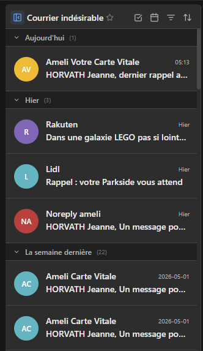 | 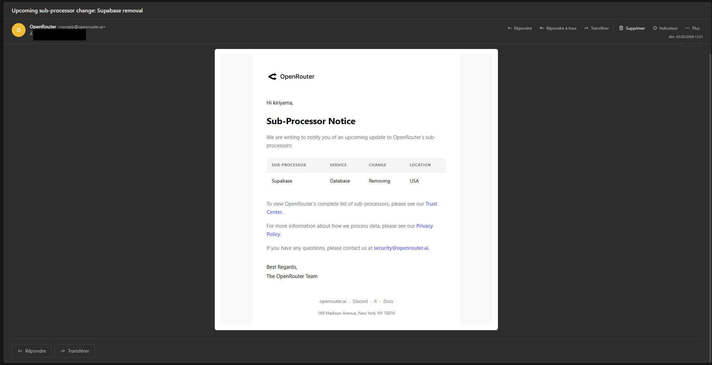 |

| Barre latérale & Favoris | Liste des contacts |
| :---: | :---: |
| 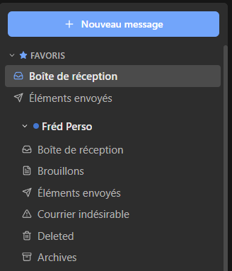 | 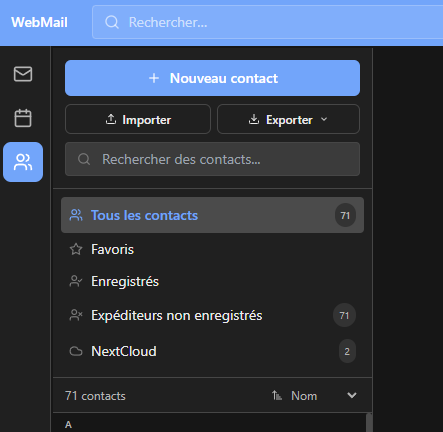 |

### Le Ruban (Style messagerie professionnelle)
| Onglet Accueil | Onglet Afficher |
| :---: | :---: |
| 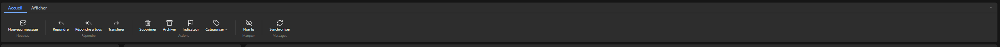 | 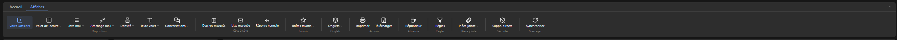 |

| Onglet Insérer | Onglet Message (Édition) |
| :---: | :---: |
| 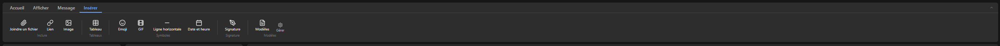 | 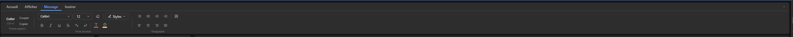 |

### Fonctionnalités avancées
| Gestion des Règles | Modèles de mail |
| :---: | :---: |
| 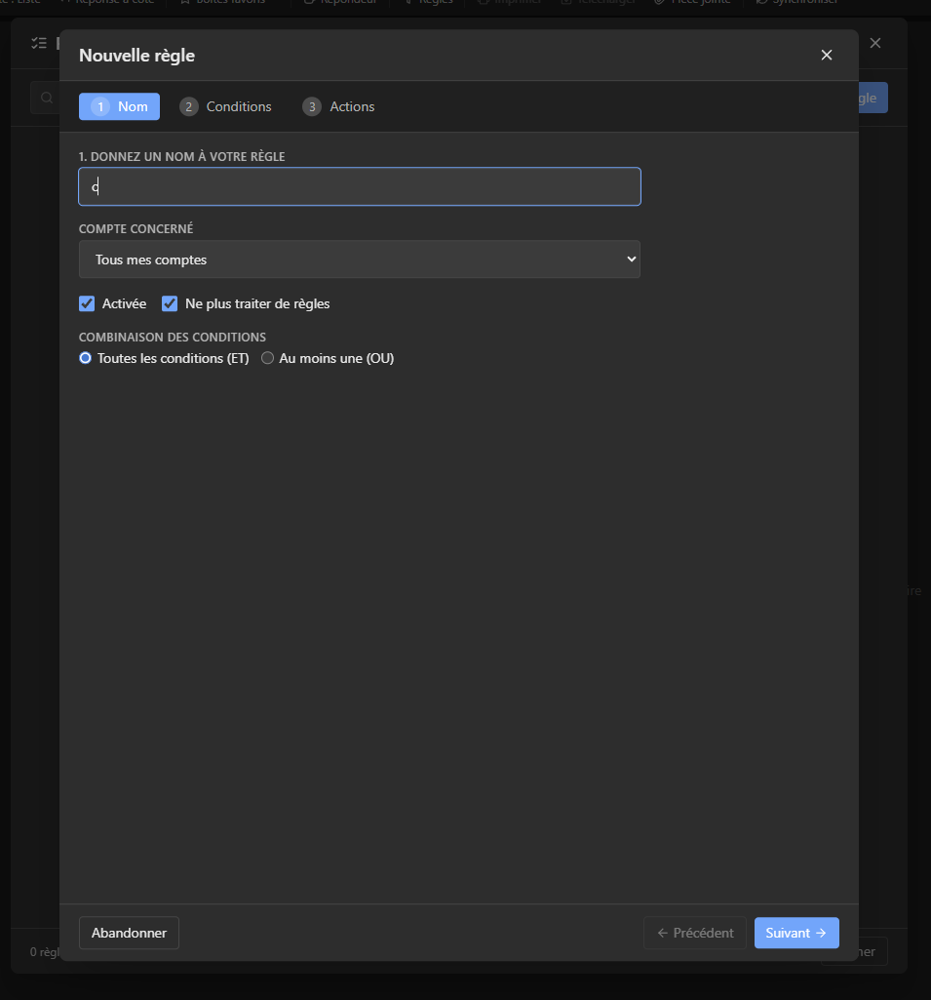 | 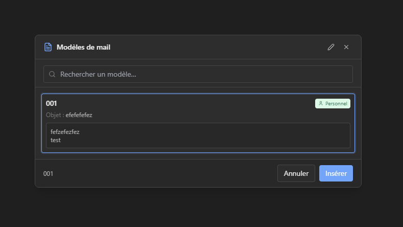 |

| Éditeur de signatures | |
| :---: | :---: |
| 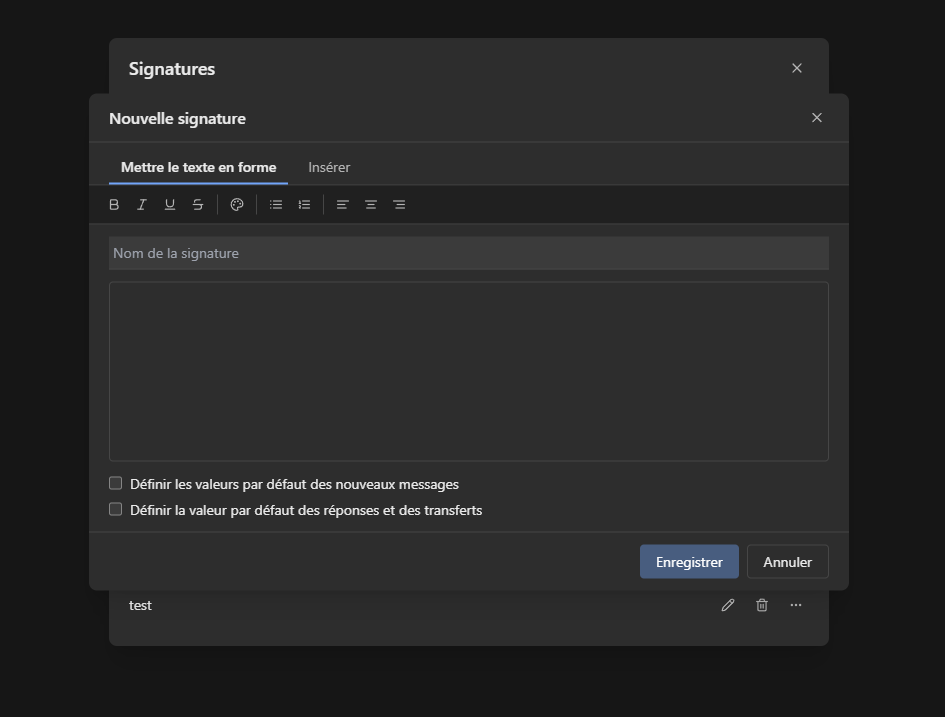 | |

### Paramètres de l'application
| Sécurité (Biométrie) | Répondeur Automatique |
| :---: | :---: |
| 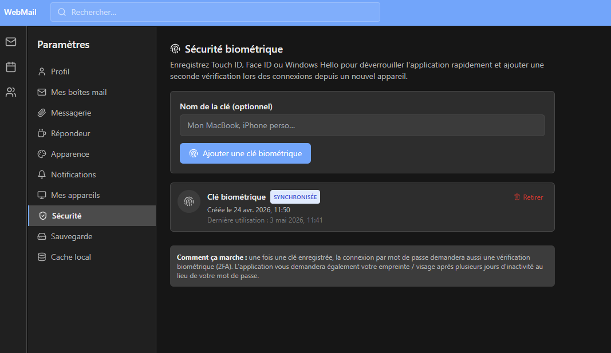 | 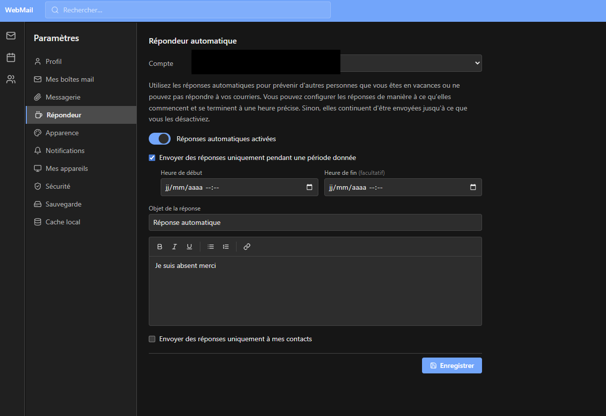 |

| Préférences de Messagerie | Vue du Calendrier |
| :---: | :---: |
| 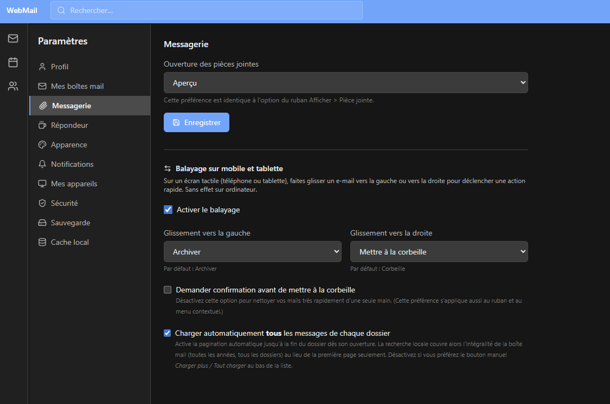 | 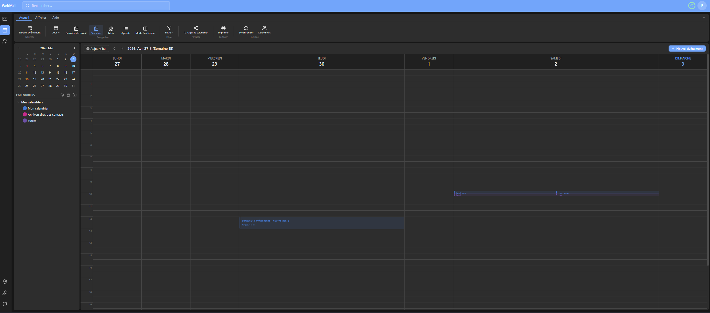 |

## Documentation

- [API complète](API.md)
- [Configuration](docs/CONFIGURATION.md)
- [Contacts et Expéditeurs](docs/CONTACTS.md)
- [NextCloud](docs/NEXTCLOUD.md)
- [Synchronisation o2switch (CalDAV / CardDAV)](docs/O2SWITCH_DAV.md)
- [Pièces jointes](docs/ATTACHMENTS.md)
- [PWA et hors-ligne](docs/PWA.md)
- [Sauvegarde & restauration](docs/BACKUP.md)

## Architecture

```
┌────────────────────────────────────────────────────────────┐
│           Clients                                          │
│  ┌─────────────┐  ┌───────────────┐  ┌─────────────────┐  │
│  │  Navigateur │  │  PWA installée│  │  Desktop (Tauri)│  │
│  │  (Web)      │  │  (standalone) │  │  Win/Linux/macOS│  │
│  └─────────────┘  └───────────────┘  └─────────────────┘  │
│        React + TypeScript + Tailwind CSS + IndexedDB        │
├────────────────────────────────────────────────────────────┤
│                    API REST + WebSocket                     │
├────────────────────────────────────────────────────────────┤
│               Express.js + TypeScript Backend               │
│  ┌──────────┐ ┌──────────┐ ┌───────────┐ ┌────────────┐  │
│  │ IMAP/SMTP│ │ CalDAV/  │ │  Plugin   │ │  Tauri     │  │
│  │ imapflow │ │ CardDAV  │ │  System   │ │  Builder   │  │
│  │nodemailer│ │ NextCloud│ │  (Ollama) │ │  API       │  │
│  └──────────┘ └──────────┘ └───────────┘ └────────────┘  │
├────────────────────────────────────────────────────────────┤
│                PostgreSQL (Drizzle ORM)                     │
├────────────────────────────────────────────────────────────┤
│  Docker Services                                           │
│  ┌──────────────┐  ┌────────────────────────────────────┐ │
│  │  app :3000   │  │  tauri-builder :4000 (profile)     │ │
│  │  (prod)      │  │  Ubuntu+Rust — builds .deb/.AppImage│ │
│  └──────────────┘  └────────────────────────────────────┘ │
└────────────────────────────────────────────────────────────┘
```

## Prérequis

- Docker & Docker Compose
- Git

## Déploiement avec Docker

### 1. Cloner le projet
```bash
git clone <repo-url>
cd webmail
```

### 2. Configurer l'environnement
```bash
cp .env.example .env
# Éditer .env avec vos paramètres
```

Variables importantes :
```env
# Base de données
POSTGRES_PASSWORD=un_mot_de_passe_fort

# Sécurité
SESSION_SECRET=une_clé_secrète_aléatoire
JWT_SECRET=une_autre_clé_secrète
ENCRYPTION_KEY=clé_hex_64_caractères  # openssl rand -hex 32
```

> L'intégration NextCloud se configure désormais entièrement depuis l'UI d'administration
> (**Admin → NextCloud**) et est stockée chiffrée en base. Les anciennes variables
> `NEXTCLOUD_URL` / `NEXTCLOUD_USERNAME` / `NEXTCLOUD_PASSWORD` ne sont plus utilisées.
> Voir [docs/NEXTCLOUD.md](docs/NEXTCLOUD.md).

### 3. Lancer avec Docker Compose
```bash
docker-compose up -d
```

L'application sera accessible sur `http://localhost:3000`

### 4. Premier utilisateur
Le premier utilisateur inscrit devient automatiquement administrateur.

## Applications Desktop (optionnel)

### Build Linux depuis Portainer/Docker

```bash
# Démarrer le service builder (Ubuntu + Rust, ~5 min au premier lancement)
docker compose --profile builder up -d tauri-builder

# Puis depuis l'interface : Admin → Applications → Build Linux
```

### Build multi-plateforme via GitHub Actions

1. Pousser le projet sur GitHub
2. Admin → Applications → section GitHub Actions
3. Renseigner owner/repo + token (`workflow` scope) + URL du serveur
4. Cliquer **Déclencher le build**
5. Les artefacts (.exe, .msi, .deb, .AppImage, .dmg) apparaissent dans les runs GitHub

> L'application desktop générée se connecte directement à l'URL du serveur spécifiée au moment du build — aucune installation locale requise.

## Déploiement avec Portainer

1. Dans Portainer, aller dans **Stacks** > **Add Stack**
2. Coller le contenu de `docker-compose.yml`
3. Ajouter les variables d'environnement
4. Cliquer sur **Deploy the stack**

## Développement local

### Installation
```bash
# Backend
cd server
npm install

# Frontend
cd client
npm install
```

### Lancer en développement
```bash
# Depuis la racine
npm run dev
```

Le frontend démarre sur `http://localhost:5173` avec proxy vers le backend sur `http://localhost:3000`.

## Structure du projet

```
webmail/
├── client/                 # Frontend React
│   ├── src/
│   │   ├── api/            # Client API (Axios)
│   │   ├── components/     # Composants React
│   │   │   ├── mail/       # Composants mail
│   │   │   │   ├── ComposeModal.tsx   # Rédaction inline/modale
│   │   │   │   ├── FolderPane.tsx     # Panneau dossiers
│   │   │   │   ├── MessageList.tsx    # Liste des messages
│   │   │   │   ├── MessageView.tsx    # Lecture d'un message
│   │   │   │   └── Ribbon.tsx         # Ruban classique/simplifié
│   │   │   └── ui/         # Composants UI génériques
│   │   ├── hooks/          # Hooks (WebSocket, réseau)
│   │   ├── pages/          # Pages (Mail, Calendar, Contacts, Settings, Admin)
│   │   ├── pwa/            # Service Worker & IndexedDB
│   │   ├── stores/         # Zustand stores (auth, mail + onglets)
│   │   └── types/          # TypeScript types
│   ├── index.html
│   └── vite.config.ts
├── server/                 # Backend Express
│   └── src/
│       ├── database/       # Schéma & connexion PostgreSQL (Drizzle)
│       ├── middleware/      # Auth middleware (JWT + session)
│       ├── plugins/        # Plugin manager
│       ├── routes/         # Routes API REST
│       ├── services/       # Mail, WebSocket, NextCloud, O2Switch
│       └── utils/          # Logger, encryption
├── plugins/                # Plugins
│   └── ollama-ai/          # Plugin IA Ollama
├── docs/                   # Documentation complémentaire
│   ├── CONFIGURATION.md    # Variables d'environnement
│   ├── NEXTCLOUD.md        # Intégration NextCloud
│   ├── ATTACHMENTS.md      # Pièces jointes (aperçu, modes, limites)
│   ├── BACKUP.md           # Sauvegarde & restauration de la config locale
│   └── PWA.md              # Mode hors-ligne
├── src-tauri/              # Projet Tauri v2 (Desktop natif)
│   ├── src/
│   │   ├── main.rs         # Point d'entrée Rust
│   │   └── lib.rs          # Config Tauri
│   ├── tauri.conf.json     # Config Tauri (URL serveur, bundle)
│   └── Cargo.toml
├── tauri-builder/          # Micro-serveur du conteneur builder
│   └── server.mjs          # API HTTP + SSE pour le build Linux
├── .github/
│   └── workflows/
│       └── tauri-build.yml # Build multi-plateforme (Win/Linux/macOS)
├── docker-compose.yml      # Inclut le service tauri-builder (profile builder)
├── Dockerfile
├── Dockerfile.tauri-builder
└── .env.example
```

## API

### Authentification
| Méthode | Route | Description |
|---------|-------|-------------|
| POST | `/api/auth/login` | Connexion |
| POST | `/api/auth/register` | Inscription |
| POST | `/api/auth/logout` | Déconnexion |
| GET | `/api/auth/me` | Utilisateur courant |

### Messagerie
| Méthode | Route | Description |
|---------|-------|-------------|
| GET | `/api/accounts` | Lister les comptes |
| GET | `/api/mail/accounts/:id/folders` | Dossiers |
| GET | `/api/mail/accounts/:id/messages` | Messages |
| POST | `/api/mail/send` | Envoyer un email |

### Contacts
| Méthode | Route | Description |
|---------|-------|-------------|
| GET | `/api/contacts` | Lister les contacts |
| GET | `/api/contacts/search/autocomplete` | Autocomplétion |
| POST | `/api/contacts` | Créer un contact |

### Calendrier
| Méthode | Route | Description |
|---------|-------|-------------|
| GET | `/api/calendar` | Calendriers |
| GET | `/api/calendar/events` | Événements |
| POST | `/api/calendar/events` | Créer un événement |

### Administration étendue
| Méthode | Route | Description |
|---------|-------|-------------|
| GET | `/api/admin/dashboard` | Statistiques système |
| GET | `/api/admin/logs` | Logs d'audit |
| GET | `/api/admin/users` | Liste des utilisateurs |
| POST | `/api/admin/users` | Créer un utilisateur |
| PUT | `/api/admin/users/:id` | Modifier un utilisateur (nom, email, rôle, actif/inactif) |
| DELETE | `/api/admin/users/:id` | Supprimer un utilisateur |
| PUT | `/api/admin/users/:id/password` | Changer le mot de passe d'un utilisateur |
| POST | `/api/admin/users/:id/reset-link` | Générer un lien de réinitialisation de mot de passe (token 24 h) |
| POST | `/api/auth/reset-password` | Consommer un token de réinitialisation (route publique) |
| GET | `/api/admin/devices` | Sessions actives de tous les utilisateurs (groupées) |
| DELETE | `/api/admin/devices/:id` | Déconnecter un appareil (admin) |
| DELETE | `/api/admin/users/:userId/devices` | Déconnecter tous les appareils d'un utilisateur |
| GET | `/api/admin/o2switch/accounts` | Comptes O2Switch |
| POST | `/api/admin/o2switch/accounts` | Ajouter un compte O2Switch |
| POST | `/api/admin/o2switch/accounts/:id/sync` | Synchroniser emails |
| POST | `/api/admin/o2switch/accounts/:id/link` | Lier un email |

### Applications & builds natifs

| Méthode | Route | Description |
|---------|-------|-------------|
| GET | `/api/admin/applications/info` | État du builder Docker + liste des binaires |
| POST | `/api/admin/applications/build/docker` | Déclenche un build Linux (conteneur tauri-builder) |
| GET | `/api/admin/applications/build/docker/log` | SSE — logs du build en temps réel |
| POST | `/api/admin/applications/build/github` | Déclenche le workflow GitHub Actions |
| GET | `/api/admin/applications/build/github/runs` | Derniers runs du workflow |
| GET | `/api/admin/applications/download/:file` | Télécharger un binaire généré |
| DELETE | `/api/admin/applications/download/:file` | Supprimer un binaire |

## Plugin Ollama AI

Le plugin `ollama-ai` intègre un modèle IA local via Ollama pour :
- **Résumer** un email
- **Suggérer** une réponse
- **Traduire** un texte
- **Améliorer** la rédaction

### Configuration
1. Installer [Ollama](https://ollama.ai)
2. Télécharger un modèle : `ollama pull llama3`
3. Dans Administration > Plugins, configurer l'URL Ollama
4. Attribuer le plugin aux utilisateurs/groupes souhaités

## Compatibilité hébergeurs

Testé avec :
- **o2switch** (IMAP/SMTP via cPanel + UAPI v3 pour la gestion email)
- Tout hébergeur supportant IMAP/SMTP standard

## Sécurité

- Mots de passe mail chiffrés (AES-256-GCM)
- Sessions sécurisées avec JWT
- Sanitisation HTML (DOMPurify)
- Protection CSRF, XSS, injection
- Helmet pour les en-têtes HTTP
- CORS configuré

## Licence

AGPL-3.0 (Affero General Public License v3.0)
